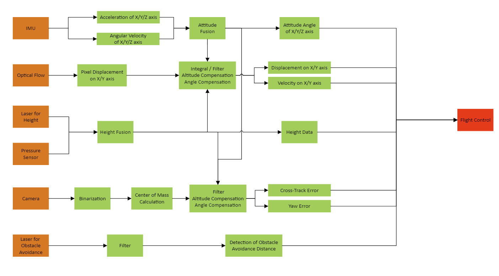
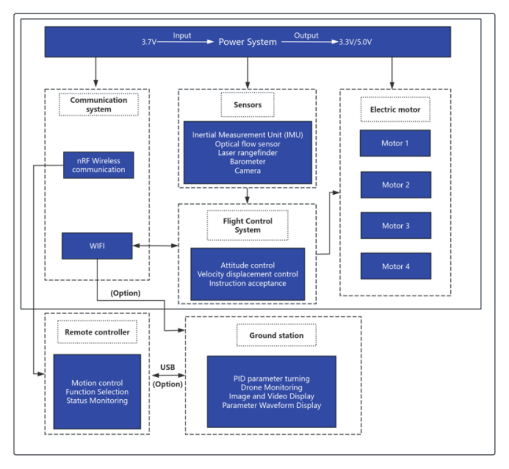
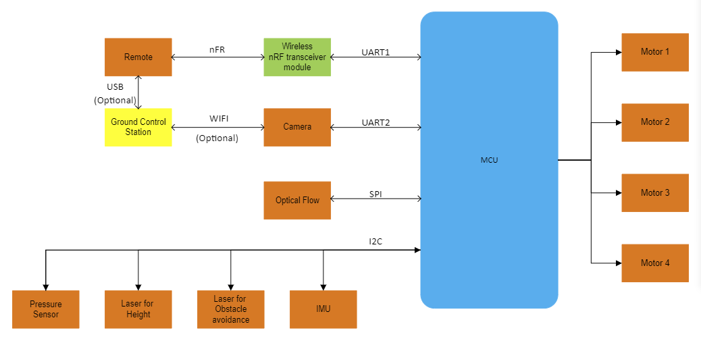

# Line-following Drone Based on STM32 and ESP32-CAM

## Overview
This project is part of the ELEC5552 Design Project at UWA in collaboration with UWA Aviation Labs and the Australian National Fabrication Facility (ANFF).

The drone's flight control system is implemented using an **STM32F103** microcontroller, while line-following is achieved through image processing on an **ESP32-CAM** module, which detects the cross-track error and yaw error and transmits this data to the flight controller. Additionally, the drone is equipped with a **VL53L1X** ToF sensor for front obstacle avoidance.

## Folder Structure
- `stm32_Drone/` - Contains the flight control code implemented on the STM32F103.
- `ESP32_710/` - Contains the ESP32-CAM code for on-board image processing with Wi-Fi 
streaming capability (approx. 10 fps).
- `ESP32_710_nowifi/` - Contains ESP32-CAM code for on-board image processing (approx. 
20 fps).

## Components
- **Drone kit**    
This drone kit was bought on Taobao for about **500 RMB**. The kit includes a remote controller, a drone frame with a set of motors and propellers, an optical flow module, and a flight control PCB. The flight control board features an **STM32F103C8T6** minimum system, an **MPU6050** as IMU, an **SI24R1** (same as **NRF24L01**) RF chip, an **AT2401C** PA chip,a **BL8530** boost IC, a **662K** LDO, and 4 NMOS to drive 4 motoers.      
*(The chips on this board are some of the cheapest on the market. I'd strongly 
recommend upgrading the power IC, as the 3.3V and 5V outputs on this board can not 
provide enough current for secondary development. Overall, I wouldn't recommend 
this drone kit. If time allows, I plan to design my own flight control board as 
part of my future improvements.)*

- **ESP32-CAM**  
The ESP32-CAM serves as the camera for visual line-following in this project and performs some image processing tasks internally. The **ESP32-CAM** is very compact and supports both **Wi-Fi** and **Bluetooth**, but it does tend to get quite hot. It's well-suited for remote monitoring and image transmission, or some basic image processing.   
In this project, the image processing is done on the board. However, if more advanced image processing algorithms are required, I recommend using Wi-Fi transmission along with remote processing.

- **Other components**  
Power Supply: A 3.7V 1200mAh LiPo battery for drone and a 250mAh LiPo battery for camera  
ToF Sensor: **VL53L1X**  
Motors: **8502 Coreless Motor**  
## How It Works
The main functionality is achieved through 4 key components: first, an image recognition algorithm is used to detect and track path lines on the ground; second, sensor data preprocessing is performed, including sensor data fusion, error compensation, and data conversion. Third, the flight control algorithm manages attitude control, position holding, speed adjustment, and line-following; finally, system integration combines image recognition with the flight control algorithm to enable smooth coordination of tasks like line-following, hovering, and other flight missions.
- **Image Recognition**  
This project’s image recognition requirements are minimal, needing only line detection in a simple environment. Thus, a custom image recognition algorithm was implemented. The ESP32-CAM with an OV2640 camera module outputs **QQVGA (120x160)** images after configuration. Each frame undergoes **binarization** using the average grayscale of the frame as the threshold. The image is divided into three sections, and for each section, the average coordinates of all black pixels along a specific axis (x or y) are calculated, repeated three times to obtain three points. Then, in this one of the three sections, average these three points to obtain the average coordinates, implementing a simple **centroid algorithm**. The resulting coordinates are then transmitted to the flight controller. This method achieves a frame rate of up to **14 fps**, with the potential for higher rates **(approx. 10 fps)** if a fixed threshold is used.

- **Data Processing**  
This component focuses on sensor data fusion, error compensation, and filtering, allowing the flight control algorithm to operate accurately. Calibration of the optical flow sensor’s speed and displacement data is especially critical to ensure precise positioning of the flight control system. The data flow diagram is shown below:

     
     <em>Figure 1: Data Processing Flowchartr</em> 

 

- **Flight controller**  
The flight control relies on **cascaded PID algorithm**, which includes:  
    - **Outer loop for attitude angles + inner loop for angular velocity**  
    Achieves control over the x, y, and z axes 
    - **Outer loop for displacement + inner loop for speed**  
    Controls position along the x, y, and z axes  
    - **Single speed loop**   
    Maintains constant speed control along the x, y, and z axes   
    - **Lateral offset loop + y-axis position loop + y-axis speed loop**   
    Enables lateral tracking of lines on the y-axis 
    - **Yaw offset loop + yaw angle loop + yaw speed loop**  
    Enables line tracking in the yaw direction   

- **System Integration**  
The system integration flowchart is as follows:

      
     <em>Figure 1: System Module Diagram</em>  
     
     <em>Figure 2: Signal Transmission Flowchartr</em>   

  

## Video Demonstration
Watch the video below to see the demonstration of **Line-following Drone**

Video 1: Hovering, automatic landing during communication loss, and e-stop demonstration

https://github.com/user-attachments/assets/c0d9c753-097c-4395-b13e-223ef031bc71  

Video 2: Obstacle detection demonstration  

https://github.com/user-attachments/assets/7b23d07d-a837-4638-974f-ef2f984fbad7  

Video 3: Line-following demonstration   

https://github.com/user-attachments/assets/df2ff14a-9840-47a3-a134-948088ff9ea1  

## Future Improvements
1. Use brushless motors
2. Implement FreeRTOS
3. Design and manufacture a custom PCB flight control board
4. Validate modern control theory

## Contact Information
For more information or to collaborate, please contact:
- **Email**: chenruifeng02@outlook.com
- **LinkedIn**: [Chenrui Feng](https://www.linkedin.com/in/chenrui-feng-244330335/)

